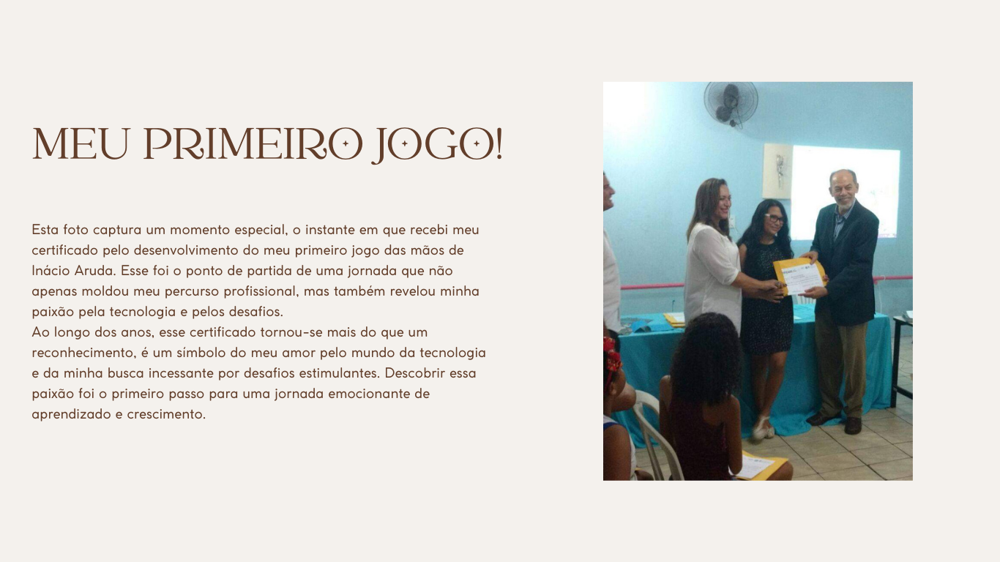
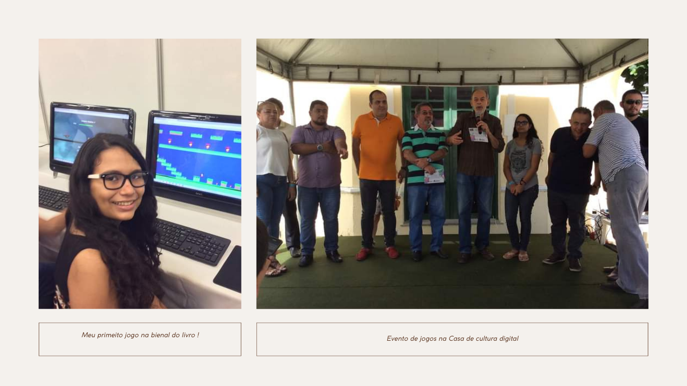
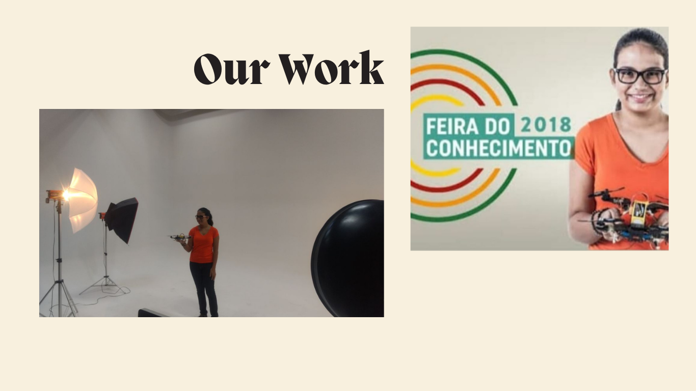
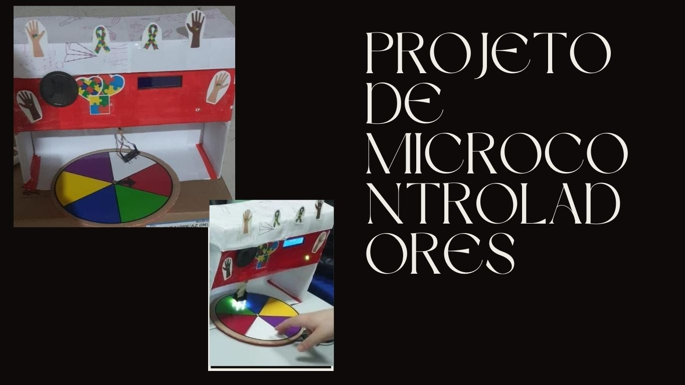
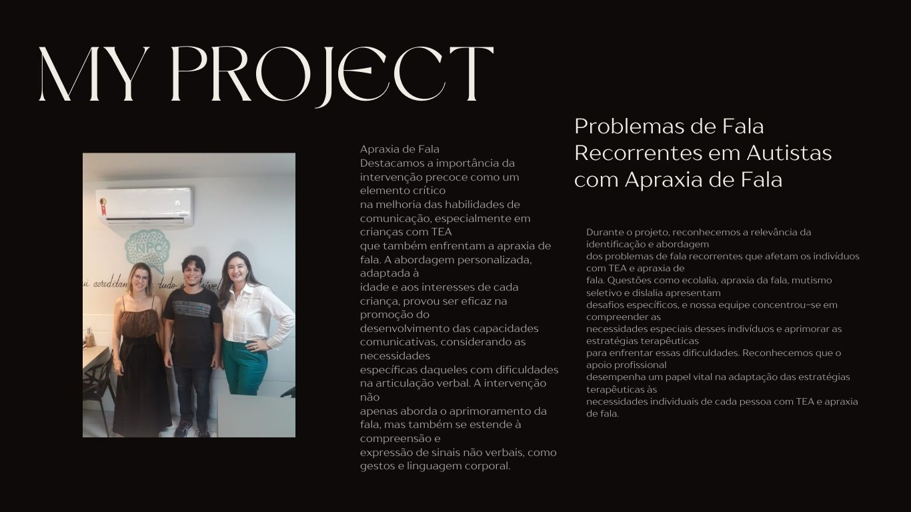
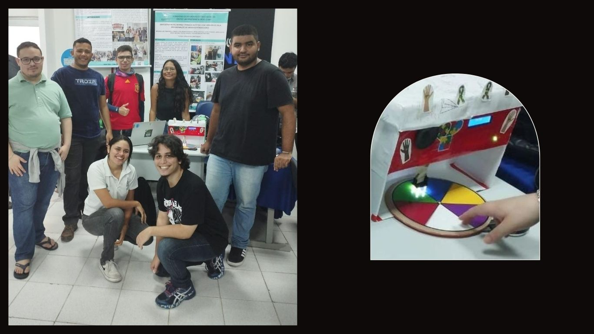
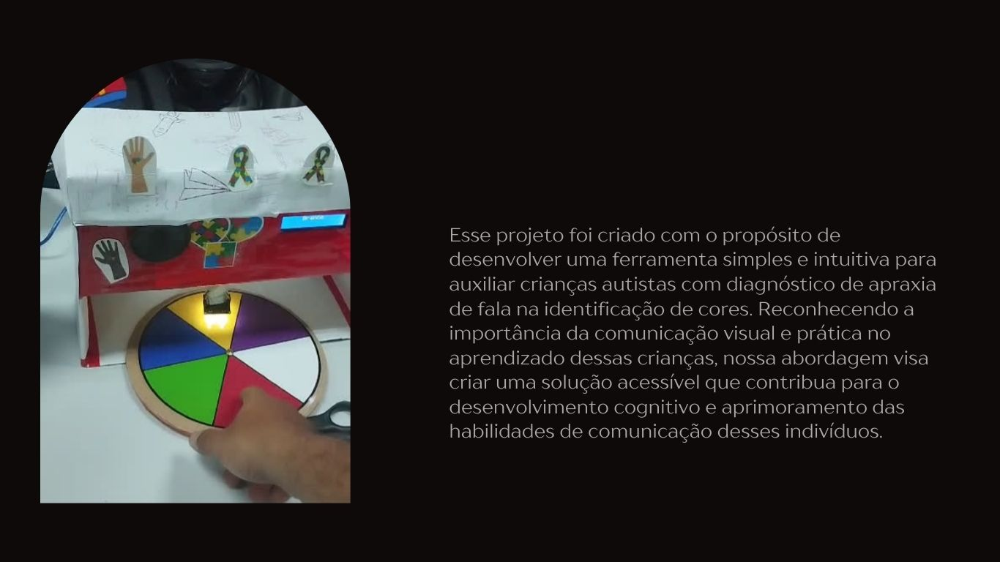

# Portfólio de Débora Laís

## Descrição
Este projeto alem de ser o meu primeiro é um portfólio pessoal criado para apresentar minhas habilidades, projetos e um pouco da minha trajetória. Utilizei HTML e CSS para construir a estrutura e o design do site, 
com a inclusão de algumas bibliotecas externas para ícones e fontes.

## Estrutura do Projeto
O projeto é composto pelos seguintes arquivos:

- `index.html`: Contém a estrutura básica da página web.
- `style.css`: Contém os estilos utilizados para formatar a página.
- `images/`: Diretório que contém as imagens utilizadas no site.

## Funcionalidades
- **Header**: Inclui o logotipo e a navegação do site.
- **Seção Topo**: Uma breve introdução sobre mim e minha história.
- **Habilidades**: Lista das minhas principais habilidades com ícones.
- **Sobre**: Uma descrição mais detalhada sobre quem sou e minha trajetória.
- **Atividades Realizadas**: Galeria de imagens dos projetos e atividades realizadas.
- **Formulário de Contato**: Um formulário para que visitantes possam entrar em contato comigo.
- **Footer**: Inclui links para minhas redes sociais e e-mail de contato.

# Codigos

```html
<!DOCTYPE html>
<html lang="pt-br">
<head>
    <meta charset="UTF-8">
    <meta name="viewport" content="width=device-width, initial-scale=1.0">
    <!-- GOOGLE FONTES -->
    <link rel="preconnect" href="https://fonts.googleapis.com">
    <link rel="preconnect" href="https://fonts.gstatic.com" crossorigin>
    <link href="https://fonts.googleapis.com/css2?family=Poppins:ital,wght@0,100;0,200;0,300;0,400;0,500;0,600;0,700;0,800;0,900;1,100;1,200;1,300;1,400;1,500;1,600;1,700;1,800;1,900&display=swap" rel="stylesheet">
    <!-- FIM GOOGLE FONTES -->
    <!-- BOOTSTRAP -->
    <!-- Bootstrap Font Icon CSS -->
    <link rel="stylesheet" href="https://cdn.jsdelivr.net/npm/bootstrap-icons@1.5.0/font/bootstrap-icons.css">
    <!-- Font Awesome CSS -->
    <link rel="stylesheet" href="https://stackpath.bootstrapcdn.com/font-awesome/4.7.0/css/font-awesome.min.css">
    <!-- FIM BOOTSTRAP -->
    <link rel="stylesheet" href="style.css">
    <title>Portifolio</title>
</head>
<body>
   
    <header>
        <div class="interface">
             <div class="logo">
                <a href="#">
                    
                </a>
            </div><!--logo-->

            <nav class="menu-desktop">
                <ul>
                    <li><a href="#">Início</a></li>
                    <li><a href="#">Habilidades</a></li>
                    <li><a href="#">Bio</a></li>
                    <li><a href="#">Atividades Realizadas</a></li>
                   
                </ul>
            </nav>
            
            <div class="Contato">
                <a href="#">
                    <button>Contato</button>
                </a>
            </div><!--contato-->>

        </div><!--interface-->
    </header>
    
    <main>
        <section class="topo-do-site">
            <div class="interface">
                <div class="flex">
                    <div class="txt-topo-site">
                        <h1>UM POUCO SOBRE A HISTORIA DA DÉBORA LAÍS<span>.</span></h1>
                        <p>Nunca imaginei que um dia trabalharia com algo que fazia por diversão. Este portfólio vai mostrar um pouco da minha trajetória, projetos e habilidades. Como um dia eu disse na minha primeira seleção de emprego: "Acredito que a tecnologia é o primeiro passo para um futuro que nossos antepassados sonharam e que hoje tentamos realizar." Como um dia Steve Jobs citou: "A tecnologia move o mundo." </p>

                        <div class="Contato">
                            <a href="#">
                                <button>Entre em Contato</button>
                            </a>
                        </div>
                    </div><!--txt-topo-site-->
                <div class="img-topo-site">
                    
                 </div><!--img-topo-site-->
                </div><!--flex-->
            </div><!--interface-->
        </section><!--topo-do-site-->

        <section class="habilidades">
            <div class="interface">
                <h2 class="titulo">MINHAS <span>HABILIDADES.</span></h2>

                <div class="flex">
                    <div class="habilidades-box">
                        <i class="bi bi-code-square"></i>
                        <h3>Website</h3>
                        <p>Conhecimentos em html e css .</p>
                    </div><!--habilidades-box-->

                    <div class="habilidades-box">
                        <i class="bi bi-translate"></i>
                        <h3>Ingles</h3>
                        <p>Conhecimentos na lingua inglesa com certificação do CCI como validação</p>
                    </div><!--habilidades-box-->

                    <div class="habilidades-box">
                        <i class="bi bi-people-fill"></i>
                        <h3>Trabalho em equipe</h3>
                        <p>Conhece os fundamentos e possui uma certificação do Linked como validação</p>
                    </div><!--habilidades-box-->

                    <div class="habilidades-box">
                        <i class="bi bi-display"></i>
                        <h3>Ciencia da Computação</h3>
                        <p>Estudante de Ciencia da Computação com previsão de graduação para 2025.</p>
                    </div><!--habilidades-box-->

                    <div class="habilidades-box">
                        <i class="bi bi-book-fill"></i>
                        <h3>Gosta de aprender</h3>
                        <p>Essa universitaria ama aprender coisas novas </p>
                    </div><!--habilidades-box-->

                    <div class="habilidades-box">
                        <i class="bi bi-box-arrow-in-right"></i>
                        <h3>AWS na prática</h3>
                        <p>Conhecimentos sobre Aws adquiridos na plataforma udemy com certificação para validação .</p>
                    </div><!--habilidades-box-->
                </div><!--flex-->
            </div><!--interface-->
        </section><!--habilidades-->

        <section class="sobre">
            <div class="interface">
                <div class="flex">
                    <div class="img-sobre">
                        
                    </div><!--img-sobre-->

                    <div class="txt-sobre">
                        <h2>MUITO PRAZER, <span>SOU DÉBORA LAÍS.</span></h2>
                        <p>Oi, sou a Debora Lais, uma universitária de 20 anos apaixonada por Ciência da Computação. Atualmente, estou cursando na  universidade estacio e mergulhando de cabeça em desafios e projetos tecnológicos. Além dos estudos, participo ativamente do "Programadores do Amanhã" e estou vivendo uma experiência incrível como estagiária na Compass UOL. Estou animada para crescer nesse mundo em constante evolução e contribuir de forma significativa para a área. É isso aí, sempre em busca de aprendizado e novas oportunidades!</p>
                        <p>Na minha jornada no "Programadores do Amanhã", tenho me dedicado não apenas ao aprendizado técnico em programação, mas também ao desenvolvimento de soft skills e ao aprimoramento do inglês. Essa experiência tem sido fundamental para a construção de uma base sólida de habilidades, preparando-me para os desafios futuros. Além disso, como estagiária na Compass UOL, estou imersa no universo prático, focando especificamente em aprimorar minhas habilidades em Linux e AWS. É incrível como cada dia traz novos conhecimentos e oportunidades de crescimento, e estou empolgada para continuar explorando e evoluindo nesse ambiente dinâmico.</p>
                        <div class="social">
                            <a href="https://www.instagram.com/lais__debora/" target="_blank" rel="noopener noreferrer"><button><i class="bi bi-instagram"></i></button></a>
                            <a href="http://www.linkedin.com/in/d%C3%A9bora-la%C3%ADs-506226229" target="_blank" rel="noopener noreferrer"><button><i class="bi bi-linkedin"></i></button></a>
                            <a href="https://github.com/Debora-Laiss" target="_blank" rel="noopener noreferrer"><button><i class="bi bi-github"></i></button></a>
                         </div><!--social-->                         
                    </div><!--txt-sobre-->
                </div><!--flex-->

            </div><!--interface-->

        </section><!--sobre-->
   
        <section class="atividades-realizadas">
            <div class="interface">
                <h2 class="titulo">ATIVIDADES <span>REALIZADAS.</span></h2>
                <div class="flex-container">
                    <div class="flex-item" id="projeto1">
                        
                        
                         
                        
                    </div>
                    <div class="flex-item" id="projeto2">
                        
                        
                        
                        
                    </div>
                
                </div><!--flex-container-->
            </div><!--interface-->
        </section><!--atividades-realizadas-->

        <section class="formulario">
            <div class="interface">
                <h2 class="titulo">FALE <span>COMIGO.</span></h2>

                <form action="">
                    <input type="text" name="" id="" placeholder="Seu nome:" required>
                    <input type="text" name="" id="" placeholder="Seu e-mail:" required>
                    <input type="text" name="" id="" placeholder="Seu celular:" required>
                    <textarea name="" id="" placeholder="Sua mensagem" required></textarea>
                    <div class="enviar"><input type="submit" value="ENVIAR"></div>
                </form>
            </div>

        </section><!--Formulario-->
    </main>

    <footer>
        <div class="interface">
            <div class="line-footer">
                <div class="flex">
                    <div class="logo-footer">
                        
                    </div><!--logo-footer-->
                    <div class="social">
                        <a href="https://www.instagram.com/lais__debora/" target="_blank" rel="noopener noreferrer"><button><i class="bi bi-instagram"></i></button></a>
                        <a href="http://www.linkedin.com/in/d%C3%A9bora-la%C3%ADs-506226229" target="_blank" rel="noopener noreferrer"><button><i class="bi bi-linkedin"></i></button></a>
                        <a href="https://github.com/Debora-Laiss" target="_blank" rel="noopener noreferrer"><button><i class="bi bi-github"></i></button></a>
                    </div><!--social-->   
                </div>  
            </div>

            <div class="line-footer">
                <p><i class="bi bi-envelope"></i> <a href="mailto:deboralaisnm@gmail.com">deboralaisnm@gmail.com</a></p>
            </div><!--line-footer-->
        </div><!--interface-->
    </footer>

</body>
</html>

```
